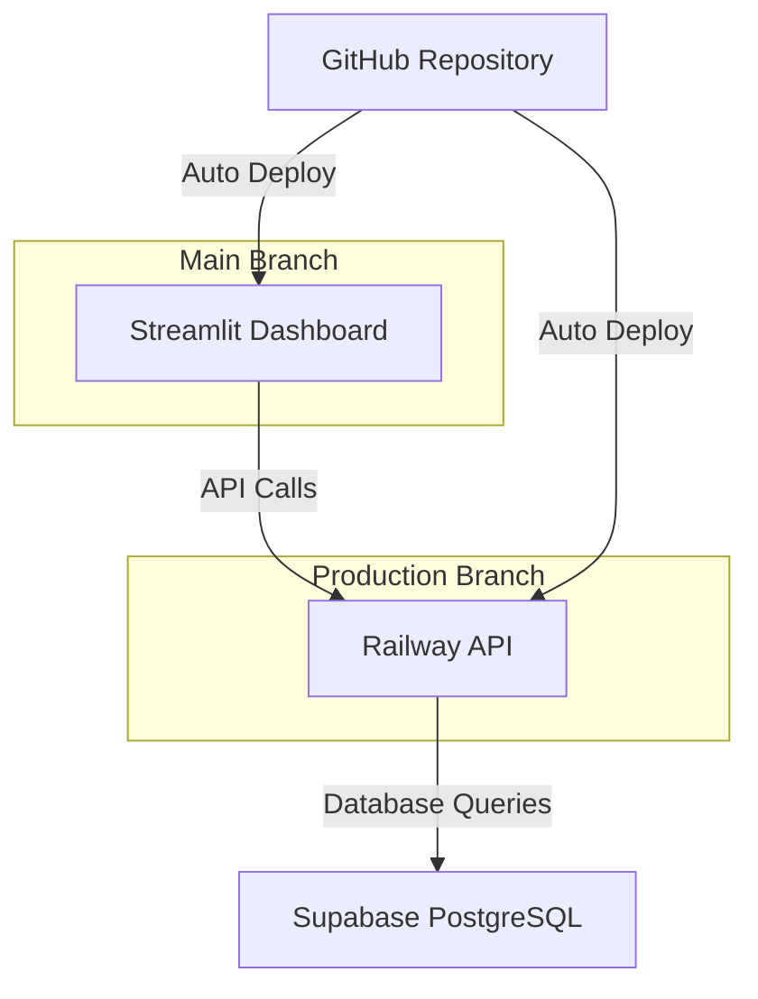

# Tax Extraction System - Architecture Overview

## 🏗️ Current Production Architecture

### Live System Components



### Production URLs
- **Dashboard**: Streamlit Cloud (from `main` branch)
- **API**: https://tax-extraction-system-production.up.railway.app (from `production` branch)
- **Database**: https://klscgjbachumeojhxyno.supabase.co

---

## 📁 File Architecture - What's Actually Being Used

### ✅ **ACTIVE FILES IN PRODUCTION**

#### API Files (Railway Deployment)
- **`api_public.py`** ✅ **[CURRENTLY DEPLOYED]**
  - Public API without authentication
  - Simple, direct Supabase queries
  - Read-only endpoints for dashboard
  - Deployed on Railway via `production` branch

#### Dashboard Files (Streamlit Cloud)
- **`streamlit_app.py`** ✅ **[CURRENTLY DEPLOYED]**
  - Simplified dashboard for Streamlit Cloud
  - No local module dependencies
  - Direct API calls to Railway
  - Uses Streamlit secrets for configuration

#### Configuration Files
- **`railway.json`** - Railway deployment configuration
- **`requirements.txt`** - Streamlit dependencies (minimal)
- **`requirements-railway.txt`** - Railway/API dependencies (full)
- **`.streamlit/config.toml`** - Streamlit configuration

---

### ❌ **DEPRECATED/UNUSED FILES** (Too Complex for Deployment)

#### API Files (Not Used)
- **`api_service_supabase.py`** ❌ 
  - Full-featured API with authentication
  - Too complex - requires auth tokens
  - Has protected endpoints that broke dashboard access

- **`api_with_auth.py`** ❌
  - Enhanced authentication features
  - JWT token management
  - Too complex for public dashboard

- **`api_service_enhanced.py`** ❌
  - Advanced features (webhooks, background jobs)
  - Requires Redis, Celery
  - Over-engineered for current needs

- **`api_service.py`** ❌
  - Original API without Supabase
  - Used local file storage
  - Superseded by Supabase integration

#### Dashboard Files (Not Used)
- **`dashboard_supabase.py`** ❌
  - Imports local modules (`supabase_client.py`, `supabase_auth.py`)
  - Failed on Streamlit Cloud due to module dependencies
  - Too tightly coupled with local code

- **`dashboard.py`** ❌
  - Original dashboard without Supabase
  - Used local file system
  - No longer relevant

- **`dashboard_streamlit.py`** ❌
  - Intermediate attempt
  - Still had complex dependencies
  - Replaced by simpler `streamlit_app.py`

- **`app.py`** ❌
  - Testing version
  - Replaced by `streamlit_app.py`

#### Support Files (Not Deployed)
- **`supabase_client.py`** - Local development only
- **`supabase_auth.py`** - Local development only
- **All extraction files** - Run locally when needed

---

## 🚀 Deployment Strategy

### Branch Strategy
```
main branch (development)
    ├── streamlit_app.py (auto-deploys to Streamlit)
    └── All development work
    
production branch (stable)
    └── api_public.py (auto-deploys to Railway)
```

### Why This Architecture Works

1. **Separation of Concerns**
   - API and Dashboard deploy independently
   - Different branches prevent accidental deployments
   - Each service has its own requirements file

2. **Simplicity Over Features**
   - Removed authentication complexity
   - No local module dependencies
   - Direct database queries instead of complex ORMs

3. **Public Access**
   - Dashboard doesn't need auth tokens
   - API provides read-only public endpoints
   - Suitable for internal dashboards

---

## 📊 Data Flow

```
1. User → Streamlit Dashboard (streamlit_app.py)
2. Dashboard → HTTP Request → Railway API (api_public.py)
3. API → Query → Supabase Database
4. API → JSON Response → Dashboard
5. Dashboard → Display → User
```

---

## 🔧 Local Development Files (Not Deployed)

### Extraction System
- `extracting-tests-818/MASTER_TAX_EXTRACTOR.py` - Main extraction engine
- `robust_tax_extractor.py` - Enhanced extraction with retry logic
- `selenium_tax_extractors.py` - Browser-based extraction
- Other extractors - Various specialized extractors

### Utilities
- `import_data_to_supabase_fixed.py` - Data import tool
- `verify_supabase_data.py` - Data verification
- `test_*.py` files - Testing utilities

---

## 🗂️ Requirements Files Chaos (Now Organized)

### Active
- `requirements.txt` - For Streamlit (4 packages only)
- `requirements-railway.txt` - For Railway API (full stack)

### Archived (in `/archive` folder)
- 9 different requirements_*.txt files
- Created confusion during deployment
- Now safely archived

---

## 💡 Lessons Learned

### What Failed
1. **Complex Authentication** - Made dashboard unable to access API
2. **Local Module Imports** - Broke Streamlit Cloud deployment
3. **Multiple Requirements Files** - Caused deployment confusion
4. **Feature-Rich APIs** - Too complex for simple dashboard needs

### What Succeeded
1. **Simple Public API** - No auth needed for read operations
2. **Standalone Files** - No local imports in deployed code
3. **Clear Separation** - Different branches for different services
4. **Minimal Dependencies** - Streamlit needs only 4 packages

---

## 🎯 Current System Status

- ✅ **102 Properties** loaded in database
- ✅ **43 Entities** configured
- ✅ **$50,058.52** outstanding taxes tracked
- ✅ **$434,291.55** previous year taxes
- ✅ **API** fully operational
- ✅ **Dashboard** displaying real-time data
- ✅ **Auto-deployment** working on both platforms

---

## 📝 Notes for Future Development

1. **Keep It Simple** - The current architecture works because it's simple
2. **Avoid Local Imports** - Cloud platforms can't handle local module dependencies
3. **Public vs Private** - Consider if auth is really needed for internal dashboards
4. **Branch Strategy** - Separate deployment branches prevent accidents
5. **Test Locally First** - But remember: local success ≠ cloud success