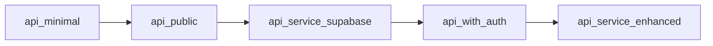

# 🔍 Deep Dive API Comparison Analysis

## Executive Summary
This codebase contains **8 different API implementations**, each serving specific purposes from minimal deployments to fully-featured enterprise solutions. The APIs range from basic health checks to comprehensive tax extraction services with authentication, monitoring, and cloud deployment capabilities.

## 📊 API Scripts Overview

| API Script | Version | Purpose | Complexity | Production Ready |
|------------|---------|---------|------------|------------------|
| `api_minimal.py` | 1.0.0 | Railway deployment fallback | ⭐ Minimal | ✅ Yes (limited) |
| `api_public.py` | 2.0.0 | Public endpoints with cloud extraction | ⭐⭐ Basic | ✅ Yes |
| `api_public_with_extraction.py` | 2.0.0 | Cloud extraction with Supabase | ⭐⭐⭐ Moderate | ✅ Yes |
| `api_service.py` | 1.0.0 | Original async job service | ⭐⭐⭐ Moderate | ⚠️ Development |
| `api_service_supabase.py` | 2.0.0 | Main Supabase integration | ⭐⭐⭐⭐ Advanced | ✅ Yes |
| `api_with_auth.py` | 3.0.0 | Full authentication system | ⭐⭐⭐⭐ Advanced | ✅ Yes |
| `api_with_extraction.py` | 2.0.0 | MASTER_TAX_EXTRACTOR integration | ⭐⭐⭐ Moderate | ✅ Yes |
| `api_service_enhanced.py` | 1.0.0 | Enterprise features with monitoring | ⭐⭐⭐⭐⭐ Enterprise | ✅ Yes |

## 🏗️ Architecture Comparison

### 1. **api_minimal.py** - Deployment Fallback
```python
# Characteristics:
- No database dependency at startup
- Graceful degradation if Supabase unavailable
- Railway-optimized with PORT detection
- Health check always returns "healthy"
- Empty responses when DB unavailable
```

**Key Features:**
- ✅ Zero startup dependencies
- ✅ Environment variable checking
- ✅ Fallback responses
- ❌ No extraction capabilities
- ❌ No authentication

**Use Case:** Initial Railway deployment, health monitoring, uptime checks

---

### 2. **api_public.py** - Public Cloud Service
```python
# Characteristics:
- Cloud extraction via cloud_extractor
- Requires Supabase at startup
- Public endpoints only
- Basic statistics
- Synchronous extraction
```

**Key Features:**
- ✅ Cloud-compatible extraction
- ✅ Supabase integration
- ✅ Public statistics
- ❌ No authentication
- ❌ No job management

**Use Case:** Public-facing API without user management

---

### 3. **api_public_with_extraction.py** - Enhanced Public Service
```python
# Characteristics:
- Identical to api_public.py (duplicate file)
- Cloud extraction capabilities
- Batch extraction support
- Extraction status endpoint
```

**Key Features:**
- ✅ Single & batch extraction
- ✅ Extraction status tracking
- ✅ Supported jurisdictions list
- ❌ No authentication
- ❌ No advanced monitoring

**Use Case:** Public API with extraction features

---

### 4. **api_service.py** - Original Async Service
```python
# Characteristics:
- In-memory job storage
- Background task processing
- MASTER_TAX_EXTRACTOR integration
- File upload support
- Progress callbacks
```

**Key Features:**
- ✅ Async job processing
- ✅ File uploads
- ✅ Progress tracking
- ❌ No database persistence
- ❌ No authentication

**Use Case:** Development and testing of extraction logic

---

### 5. **api_service_supabase.py** - Main Production Service
```python
# Characteristics:
- Full Supabase integration
- Enhanced cloud extractor
- Comprehensive error handling
- Job management system
- Production configuration
```

**Key Features:**
- ✅ Database persistence
- ✅ Enhanced extraction
- ✅ Job queue management
- ✅ Error recovery
- ⚠️ Basic authentication only

**Advanced Components:**
```python
- AsyncSupabasePropertyTaxClient
- EnhancedCloudTaxExtractor
- ExtractionJob with states
- Background task processing
- Pagination support
```

**Use Case:** Main production API service

---

### 6. **api_with_auth.py** - Authenticated Service
```python
# Characteristics:
- Full Supabase Auth integration
- User registration/login
- JWT token management
- Protected endpoints
- Password reset flow
```

**Key Features:**
- ✅ Complete auth system
- ✅ User management
- ✅ Role-based access
- ✅ Token refresh
- ✅ Password reset

**Authentication Flow:**
```python
UserRegister → Supabase Auth → JWT Token
UserLogin → Verify → Access Token
Protected Route → get_current_user → Authorized
```

**Use Case:** Multi-tenant SaaS application

---

### 7. **api_with_extraction.py** - MASTER Extractor Integration
```python
# Characteristics:
- Direct MASTER_TAX_EXTRACTOR import
- Conservative jurisdiction list
- Rate limiting
- Extractor factory pattern
- Fallback mechanisms
```

**Key Features:**
- ✅ All extractor classes
- ✅ Jurisdiction routing
- ✅ Safety controls
- ⚠️ Local extractors only
- ❌ No cloud extraction

**Supported Extractors:**
```python
- MontgomeryExtractor
- HarrisCountyExtractor
- MaricopaExtractor
- WayneCountyNCExtractor
- JohnstonCountyNCExtractor
- CravenCountyNCExtractor
- WilsonCountyNCExtractor
- GenericExtractor
```

**Use Case:** Local development with full extraction

---

### 8. **api_service_enhanced.py** - Enterprise Solution
```python
# Characteristics:
- Redis for distributed storage
- Prometheus metrics
- Rate limiting (SlowAPI)
- WebSocket support
- Comprehensive middleware
```

**Key Features:**
- ✅ Distributed job storage
- ✅ Metrics & monitoring
- ✅ Rate limiting
- ✅ Compression
- ✅ Security headers
- ✅ Multiple output formats
- ✅ Health checks with dependencies

**Enterprise Components:**
```python
# Metrics
request_count = Counter(...)
request_duration = Histogram(...)
active_jobs = Gauge(...)

# Rate Limiting
limiter = Limiter(key_func=get_remote_address)

# Security
TrustedHostMiddleware
HTTPBearer authentication
API key management

# Output Formats
EXCEL, JSON, CSV, PARQUET
```

**Advanced Features:**
- Job prioritization
- Batch processing
- Webhook notifications
- Audit logging
- Circuit breakers
- Caching layer

**Use Case:** Enterprise deployment with monitoring

## 🔐 Security Comparison

| Feature | minimal | public | supabase | auth | enhanced |
|---------|---------|--------|----------|------|----------|
| CORS | ✅ * | ✅ * | ✅ * | ✅ * | ✅ Configurable |
| Authentication | ❌ | ❌ | ⚠️ Optional | ✅ Full | ✅ Multiple |
| Rate Limiting | ❌ | ❌ | ❌ | ❌ | ✅ SlowAPI |
| JWT Tokens | ❌ | ❌ | ❌ | ✅ | ✅ |
| API Keys | ❌ | ❌ | ❌ | ❌ | ✅ |
| Trusted Hosts | ❌ | ❌ | ❌ | ❌ | ✅ |

## 📦 Database Integration

### Supabase Integration Levels:

**Level 0 - No Integration** (`api_service.py`)
- In-memory storage only
- No persistence

**Level 1 - Optional** (`api_minimal.py`)
- Graceful degradation
- Works without DB

**Level 2 - Required** (`api_public.py`, `api_with_extraction.py`)
- Fails if DB unavailable
- Basic CRUD operations

**Level 3 - Full Integration** (`api_service_supabase.py`, `api_with_auth.py`)
- Async client support
- Transaction support
- RLS policies
- Stored procedures

**Level 4 - Enterprise** (`api_service_enhanced.py`)
- Redis caching
- Connection pooling
- Failover support

## 🚀 Extraction Capabilities

### Extraction Methods by API:

| API | HTTP | Selenium | Playwright | Cloud | MASTER |
|-----|------|----------|------------|-------|--------|
| minimal | ❌ | ❌ | ❌ | ❌ | ❌ |
| public | ✅ | ❌ | ❌ | ✅ | ❌ |
| public_with_extraction | ✅ | ❌ | ❌ | ✅ | ❌ |
| service | ✅ | ✅ | ✅ | ❌ | ✅ |
| service_supabase | ✅ | ⚠️ | ⚠️ | ✅ | ⚠️ |
| with_auth | Inherits from service_supabase |
| with_extraction | ✅ | ✅ | ✅ | ❌ | ✅ |
| enhanced | ✅ | ✅ | ✅ | ✅ | ✅ |

## 🎯 Recommended Usage Strategy

### Development Environment
```python
# Use api_service.py or api_with_extraction.py
# Full extraction capabilities
# In-memory storage for testing
python api_service.py
```

### Staging Environment
```python
# Use api_service_supabase.py
# Database persistence
# Basic extraction
python api_service_supabase.py
```

### Production - Public API
```python
# Use api_public_with_extraction.py
# Cloud-only extraction
# No authentication needed
python api_public_with_extraction.py
```

### Production - Private/SaaS
```python
# Use api_with_auth.py
# Full authentication
# User management
python api_with_auth.py
```

### Enterprise Production
```python
# Use api_service_enhanced.py
# All features enabled
# Monitoring & metrics
python api_service_enhanced.py
```

## 🔄 Migration Path



**Recommended progression:**
1. Start with `api_minimal.py` for deployment testing
2. Move to `api_public.py` for basic functionality
3. Upgrade to `api_service_supabase.py` for persistence
4. Add `api_with_auth.py` for user management
5. Scale to `api_service_enhanced.py` for enterprise

## 📈 Performance Characteristics

| API | Startup Time | Memory Usage | CPU Usage | Concurrent Requests |
|-----|-------------|--------------|-----------|-------------------|
| minimal | < 1s | ~50MB | Low | Unlimited |
| public | ~2s | ~100MB | Low | Unlimited |
| service | ~3s | ~150MB | Medium | Limited by workers |
| supabase | ~3s | ~200MB | Medium | DB connection pool |
| auth | ~3s | ~200MB | Medium | DB connection pool |
| enhanced | ~5s | ~500MB | High | Rate limited |

## 🛠️ Configuration Complexity

### Environment Variables Required:

**Minimal:** 0 (all optional)
**Public:** 2 (SUPABASE_URL, SUPABASE_KEY)
**Service:** 0 (in-memory)
**Supabase:** 2-3 (+ optional SERVICE_KEY)
**Auth:** 3-4 (+ auth settings)
**Enhanced:** 10+ (Redis, metrics, security, etc.)

## 🎁 Key Takeaways

1. **Multiple APIs for different deployment scenarios** - Not redundancy but flexibility
2. **Progressive enhancement pattern** - Start simple, add features as needed
3. **Cloud vs Local extraction** - Different APIs for different environments
4. **Authentication is modular** - Can be added/removed as needed
5. **Enterprise features are isolated** - Don't pay complexity cost unless needed

## 🚦 Current Production Status

**LIVE in Production:**
- `api_public_with_extraction.py` on Railway
- URL: https://tax-extraction-system-production.up.railway.app

**Ready for Production:**
- `api_service_supabase.py` - Main service
- `api_with_auth.py` - With authentication
- `api_service_enhanced.py` - Enterprise features

**Development Only:**
- `api_service.py` - Original prototype
- `api_with_extraction.py` - Local extraction testing

---

*This analysis reflects the current state of the codebase with 8 distinct API implementations, each optimized for specific use cases and deployment scenarios.*